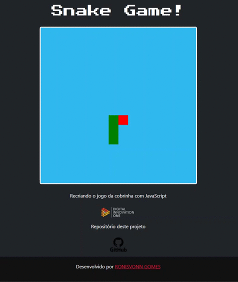

<!--Banner -->

  

<!--About session-->
<h1 align="center">Recriando o jogo da cobrinha com JavaScript Digital Innovation One</h1>

Curso do Bootcamp HTML Web Developer da [Digital Innovation One](https://digitalinnovation.one/).

Já pensou em criar seu próprio jogo do zero? Aprenda a desenvolver de forma simples o clássico jogo da cobrinha (Game Snake) utilizando HTML, CSS e JavaScript.

- [Projeto desenvolvido](#)

<!-- 

  -->

<h3>👨‍💻 Tecnologias utilizadas</h3>

- [HTML](https://www.w3schools.com/html/)
- [CSS](https://developer.mozilla.org/pt-BR/docs/Web/CSS)
- [JavaScript](https://developer.mozilla.org/en-US/docs/Web/JavaScript) 

<!--License session-->
<h3>📝 Licença</h3>

- Este projeto está sob a licença [MIT](./LICENSE). 

<!--Bottom session-->
 <h4 align=center>Feito com por <a target="_blank" href="" >RONISVONN GOMES</a></h4>